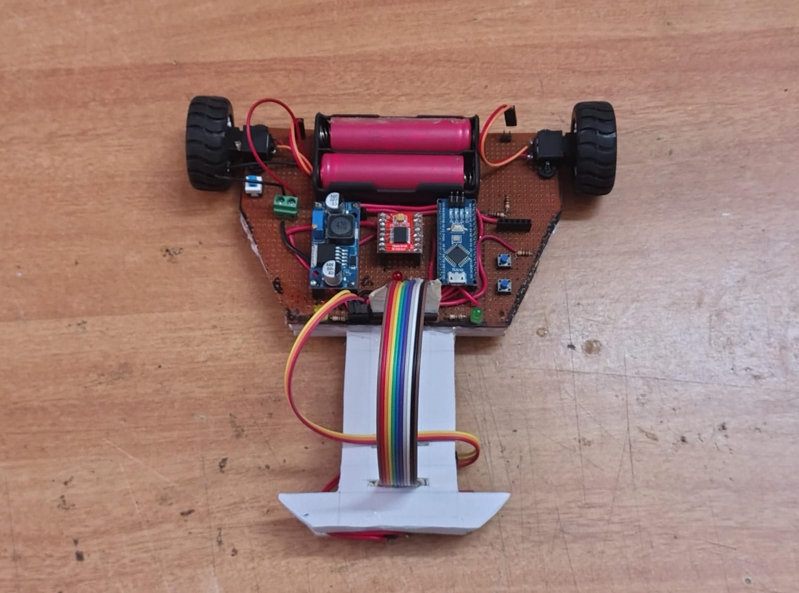

# Line Follower Robot – Competition Edition

This project is an Arduino Nano-based line follower robot built for a competitive event. It uses a QTR 8RC IR sensor array for line detection, a TB6612FNG motor driver, and a Hall effect sensor to trigger tasks via magnets embedded in the track. The robot is designed to complete a series of tasks as per the competition rules.

---

## Competition Rules & Task Flow

- **Track:** Solid black, 25mm wide, revealed at the venue. Includes 90° turns, bends, zig-zags, and shapeless sections.
- **Tasks are triggered by magnets under the track (detected by Hall effect sensor):**
    1. **Stop for 5 seconds**
    2. **Turn on red LED** (remains ON until next trigger)
    3. **Turn on yellow LED, turn OFF red** (yellow remains ON until next trigger)
    4. **Turn on green LED (always ON till end), turn OFF red**
    5. **360° rotation**
    6. **Ignore this trigger**
    7. **Reverse traverse (180° rotation)**
    8. **Second reverse traverse trigger**
    9. **Stop the bot permanently**

- **Mandatory Components:** Red, yellow, green LEDs; Hall effect sensor (A3144 or reed switch).
- **Scoring:** Points for each section, task, and finish. Penalties for hand touches and debugging time.

---

## Hardware Used

- **Arduino Nano**
- **TB6612FNG Motor Driver**
- **QTR 8RC IR Sensor Array**
- **Hall Effect Sensor (A3144, analog out)**
- **Push Button** (for calibration/run)
- **3 LEDs:** Red, Yellow, Green (common GND, positive to digital pins)
- **7.4V Li-ion Battery Pack**
- **Buck Converter** (powers Arduino and sensors)
- **HC-05 Bluetooth Module** *(hardware present, but not implemented in current code)*

---

## Circuit Connections

**Motor Driver (TB6612FNG):**
- AIN1 = D7
- AIN2 = D8
- PWMA = D5
- BIN1 = D9
- BIN2 = D11
- PWMB = D6
- STBY = VCC (hard-wired)
- VCC/GND = Battery

**QTR Sensor Array:**
- GND/VCC = Buck converter
- IR ON = VCC (hard-wired)
- Sensor 1 = D10
- Sensor 2 = A0
- Sensor 3 = A1
- Sensor 4 = A2
- Sensor 5 = A3
- Sensor 6 = A4
- Sensor 7 = A5
- Sensor 8 = D3

**Other:**
- Push Button = D13
- Red LED = D12
- Yellow LED = D2
- Green LED = D4
- Hall Effect Sensor Signal = A6

---

## Usage

1. **Upload** `line_follower.ino` to your Arduino Nano.
2. **Power on** the robot.
3. **Press the button** to start sensor calibration (robot rotates to calibrate).
4. **Press the button again** to start line following and task execution.
5. The robot will follow the line and perform tasks as it detects magnets.

---

## Images

**Front View:**  

**Back View:**  

**Side View:**  

**At the Competition:**  

---

## Notes

- **Current code may have issues with tight corners and 90° turns.**
- *Bluetooth module is not implemented in this version.*
- For best results, tune PID values in code and adapt to the actual track during the allowed modification period.

---

**Good luck at the competition!**
